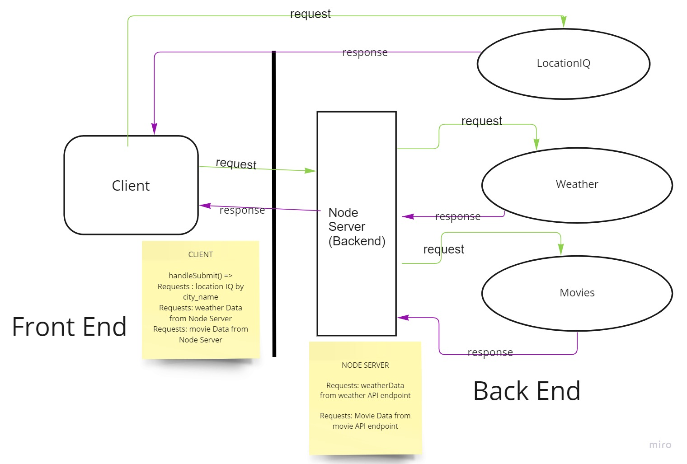

# City Explorer

**Author**: Scottie Houghton
**Version**: 1.0.0 (increment the patch/fix version number if you make more commits past your first submission)

## Overview
* Allow users to enter a city they want to explore and get info about it, including latitude, longitude, an image of a map of the city and a 3-day forecast.

<!-- Provide a high level overview of what this application is and why you are building it, beyond the fact that it's an assignment for this class. (i.e. What's your problem domain?) -->

## Getting Started
* Install React and its Bootstrap and Axios libraries. You will also need Express JS and dotenv.

<!-- What are the steps that a user must take in order to build this app on their own machine and get it running? -->

## Architecture
* Using HTML, CSS and Javascript and React libraries, including Bootstrap and Axios.

<!-- Provide a detailed description of the application design. What technologies (languages, libraries, etc) you're using, and any other relevant design information. -->

## Change Log
* 06-20-2022 9:30pm - Application has a GET route to LocationIQ. It has a form you can input a city into. The form retrieves data using LocationIQ's API and renders the city name, latitude, longitude and displays an image of a map of the city.

* 06-22-2022 8:40pm - Added a state to hold data from server. Added my server to my .env. Added an Axios GET to my handleSubmit to grab the data from my server. Set state with the data from my server. Rendered the 3-dau forecast to the website. Changed my HTML form to a React Form. Added a little bit of CSS.

* 06-22-2022 8:40pm - Added a state to hold data from server. Added my server to my .env. Added an Axios GET to my handleSubmit to grab the data from my server. Set state with the data from my server. Rendered the 3-dau forecast to the website. Changed my HTML form to a React Form. Added a little bit of CSS.

* 06-23-2022 11:30pm - Got my back end to render a 5-day forecast to my front end using the Weatherbit API. Started working on pulling data from the movie database api in the back end and rendering it on the front end.

* 06-24-2022 6:45pm - Attempted to get Movies API data to render on my front end by setting up the route and class.

* 06-24-2022 6:45pm - Attempted to get Movies API data to render on my front end by setting up the route and class.

## Credit and Collaborations
* Lab 06 Partner: KC Hofstetter

* Lab 07 Partner: Matthew Larkin

* Lab 08 Partner: Kris Dunning

## Lab: Class 06 - Asynchronous code, and APIs

Estimate of time needed to complete: 5 hours

Start time: 2:00pm

Finish time: 9:00pm

Actual time needed to complete: 7 hours

## Lab: Class 07 - Custom Servers with Node and Express

Estimate of time needed to complete: 3 hours

Start time: 8:00pm

Finish time: 11:00pm

Actual time needed to complete: 3 hours

## Lab: Class 08 - APIs

Estimate of time needed to complete: 5 hours

Start time:
* 06-22-2022: 10:00pm
* 06-23-2022: 3:00pm
* 06-24-2022: 3:30pm
* 06-25-2022: 4:30pm

Finish time:
* 06-22-2022: 11:30pm
* 06-23-2022: 6:00pm
* 06-24-2022: 5:30pm
* 06-25-2022: 5:30pm

Actual time needed to complete: 7.5 hours